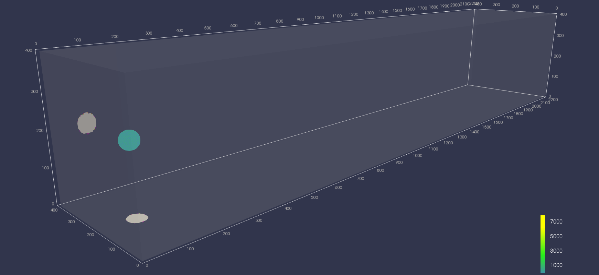
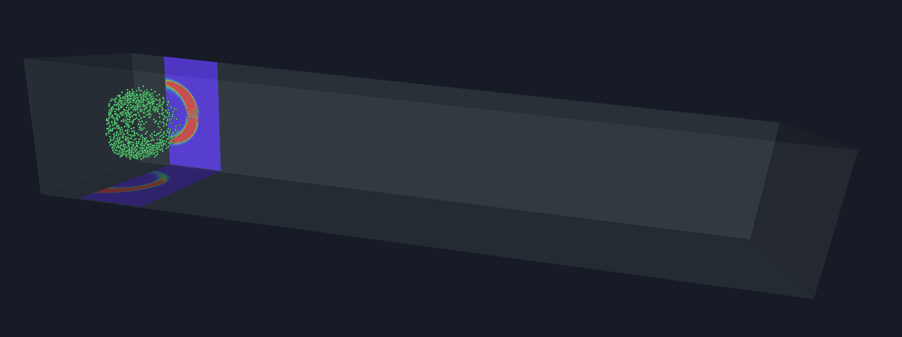

## Počítačová grafika  
## ve vědě

---?image=assets/eli_logo.jpg&size=auto 90%

---

### ELI Beamlines

Součástí evropského projektu ELI (Extreme Light Infrastructure)

Několik pracovišť na území České republiky, Maďarska a Rumunska

Zkoumání interakce světla s hmotou při nejvyšších intenzitách a nejkratších časových rozpětích

Note:
Největší vedecký projekt ČR v historii - 7.5 mld Kč (85% z EU)

---

### ELI Beamlines

Molekulární a biomedicínské aplikace

Zdroje ultrakrátkých pulzů tvrdého rengenového záření

Fyzika plazmata a exotické fyzika

Urychlování iontů

Undulátorový rentgenový zdroj

Note:
E1 - studium vlastností materiálů a biologických vzorků
E2 - studium vzorků, které nechceme ničit destruktivnímí metodami
E3 - teplá husta hmota, plazmová fyzika
E4 - protonová terapie rakoviny
E5 - studium malých struktur - velikost atomů 

---?image=assets/eli_budova.jpg

---

### Video E3 render FIXME:

---

## Virtual Beam Lines

---

### Virtual Beam Lines

Kompletní životní cyklus laserového experimentu a budovy ELI  

Design experimentů, výuková pomůcka, PR  

Unity vs. WebGL  

TODO: demo na telefonu?

Note:
Design experimentu (vbl)
Simulace (externí sw)
Vizualizace simulací (vbl) 
Podklady pro reálny experiment (externí sw)
Vizualizace výsledků (vbl)
Transformace dat (Jupyter notebook)

---

### Problémy

Enormní velikost modelu  
@size[0.6em](60 mil tri, 31 mil vert, 3500+ unikátních objektů)

LOD  
@size[0.6em](Automatické generování má různorodé výsledky)

Zdrojová data  
@size[0.6em](Každý pes jiná ves)

Note:
Každý konstruktér (autor modelů) má jiný bordel v modelu

---

### Problémy

Tradeoffs  
@size[0.6em](Paměť, CPU, síť)

Optimalizace  
@size[0.6em](Never ending story)

UX  
@size[0.6em](Složitost navigace, velký rozptyl typů uživatelů)

Note:
Index + vertex buffer cca 600MB holá data
3500 draw callu na telefonu je v pohodě, ale setování uniformů je brutálně drahé

---

### Vizualizace experimentů
  
Domácí cluster produkuje obrovská kvanta dat  
  
Fyzici rozumí povaze dat, ne však vizualizacím  
  
Paraview

Note:
Stovky GB nejsou nic neobvyklého
Bez kontextu jsou vizualizace od vědců velmi špatně pochopitelné

---?image=assets/paraview-jirka.png&size=auto 90%

---?image=assets/grief.jpg&size=auto 90%

Note:
Paraview běžně umírá / nezvládá, občas se nechce vykreslit nějaký frame, nvidia index zkušenosti, problém s matematickými fonty, export závislý na rozlišení, video export per frame a občas nejaký chybí

---

### Vizualizace experimentů

Předzpracování v Paraview

Tvorba prezentačního videa

Vizualizace ve WebGL na míru  
@size[0.4em](Alespoň prozatím)

Note:
Základní analýza dat, zjišťování smysluplných rozsahů, tvorba videí

---

### Zdrojová data

Částicová data  
@size[0.6em](Protony, elektrony, neutrony, gamma a jejich variace)

Skalární data
@size[0.6em](Z detektorů - intenzita, Ramanův posun - spektroskopie)

Objemová data - projekce a řezy  
@size[0.6em](Energie, náboj, hustota, ...)

Note:
2D i 3D data, na skalární data d3.js - na nestatická data mizerně pomalé

---

### Existující frameworky

Unity

TODO: obrázek

Note:
Default assets jsou extrémně mizerné, i placené nemají požadovaný výkon
Zobrazení pouze podmnožiny dat

---

### Existující frameworky

Paraview nativní vtk.js framework

@div[left-50]

@divend

@div[right-50]

@divend

Note:
Export z Paraview pomocí python skriptu
Nakonec se nam podařilo dopsat loadery a scénu alespoň částečně načíst - extrémní loading time, 6fps
---

### Existující frameworky

three.js částicové systémy

Note:
Snesitelný počet FPS, loading celé scény = minuty, threejs = moloch, uprava shaderů je hell

---

### Vlastní řešení

Nedostatečný výkon, problémová integrace s VBL

GPU instancing částic v prakticky čistém WebGL  
@size[0.6em](Framework twgl.js)

Toolchain pro konverzi dat  
@size[0.6em](Založený na node.js)  
@size[0.6em](\*.h5, \*.csv, \*.vtk, ...)

---?image=assets/vblelibeamseu.png&size=auto 90%

---

TODO: maly tym
TODO: nabidka prace